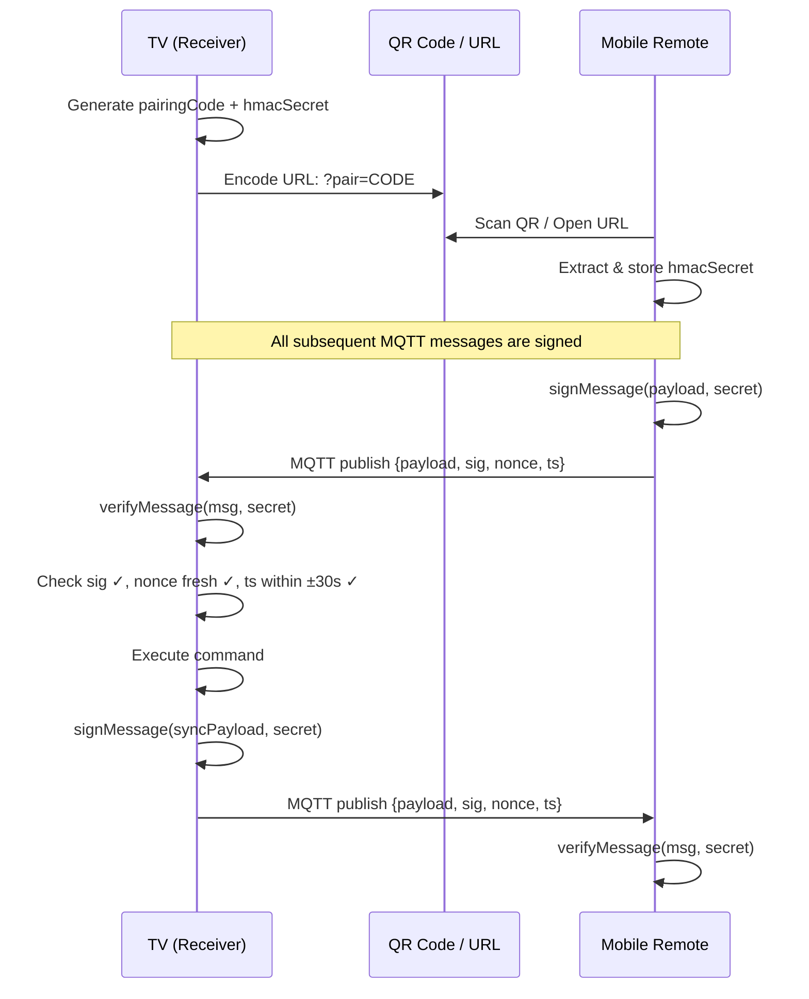

# Implementation Plan: HMAC-SHA256 Authentication for MQTT Remote Control

Compiled from the **Project Architect** and **Security Engineer** reviews.

## Problem Statement

The LiveStreamViewer connects to a **public MQTT broker** (`wss://broker.emqx.io:8084/mqtt`) with zero authentication. Anyone can eavesdrop on all commands/state syncs and inject arbitrary remote-control commands — including `refreshAll` (forces page reload) and `addStream` (injects URLs).

**Chosen solution**: Implement HMAC-SHA256 message signing so only devices holding the shared secret can produce or accept valid messages.

> [!IMPORTANT]
> HMAC provides **authentication and integrity**, not **confidentiality**. Sync payloads (stream URLs, layout config) remain readable on the wire. This is acceptable for public stream URLs. If private data is ever added, AES-GCM encryption would be needed on top.

---

## User Decisions Selected

- **Decision 1: Manual Pairing Code Entry**: Let's allow insecure fallback with a warning but push for QR code.
- **Decision 2: TV-to-TV Sync**: Allow the phone client to share secrets. Since the only way to pair is using the phone client, it can coordinate the secret share.
- **Decision 3: HTTP/LAN fallback**: Yes, let's provide fallback for non-https.
- **Decision 4: Transition Period**: Let's enforce signed messages immediately (no transition period/allowing unsigned messages).

---

## Architecture Overview



---

## Proposed Changes

### Cryptographic Utilities (New Code ~120 LOC)

#### [NEW] HMAC utility functions — added after [L3134](file:///home/jazden/Projects/LiveStreamViewer/app.js#L3134)

| Function | Purpose |
|---|---|
| `generateHmacSecret()` | Generate 256-bit base64url random secret |
| `base64urlEncode(bytes)` / `base64urlDecode(str)` | Encoding utilities |
| `hexToBytes(hex)` | Convert hex string to Uint8Array |
| `signMessage(payloadObj, secret)` | Sign payload → envelope JSON string |
| `verifyMessage(rawStr, secret)` | Verify envelope → payload or `null` |
| `pruneNonces()` | Evict expired nonces from bounded cache |

**Crypto parameters** (both agents agree):

| Parameter | Value |
|---|---|
| Algorithm | HMAC-SHA-256 |
| Key length | 256 bits (32 bytes) |
| Key encoding | Base64url (URL-safe, no padding) |
| Nonce | 128-bit random, hex-encoded (32 chars) |
| Timestamp | `Date.now()` (milliseconds) |
| Acceptance window | ±30 seconds |
| Nonce cache | 500 entries, 60s TTL |

**Message envelope format**:
```json
{
  "p": "{\"from\":\"remote\",\"action\":\"ping\",\"data\":{}}",
  "s": "a1b2c3d4...",
  "n": "f7e8d9c0...",
  "t": 1749397200000
}
```

---

## Proposed Changes (File Details)

### Secret Generation & Exchange

#### [MODIFY] [app.js — initTVPairing()](file:///home/jazden/Projects/LiveStreamViewer/app.js#L3150-L3218)
- Generate 256-bit HMAC secret alongside the pairing code
- Store in cookie `pairing_hmac_secret` (same lifetime as `pairing_code`)
- Load existing secret on subsequent runs

#### [MODIFY] [app.js — openPairingModal()](file:///home/jazden/Projects/LiveStreamViewer/app.js#L3410-L3442)
- Include secret in pairing URL as a **URL fragment** (`#secret=...`) so it's never sent to any server
- QR code encodes the full URL including fragment

#### [MODIFY] [app.js — copyPairingURL()](file:///home/jazden/Projects/LiveStreamViewer/app.js#L3455-L3462)
- Include `#secret=...` in copied URL

#### [MODIFY] [app.js — regeneratePairingCode()](file:///home/jazden/Projects/LiveStreamViewer/app.js#L3464-L3478)
- Generate **new** HMAC secret alongside new code (invalidates all paired remotes)

#### [MODIFY] [app.js — initMobileRemote()](file:///home/jazden/Projects/LiveStreamViewer/app.js#L3977-L4069)
- Extract `secret` from URL fragment on pairing
- Store per-display in `pairedDisplays[].hmacKey` in localStorage

---

### Publish Sites (5 locations)

All `.publish()` calls must wrap payloads through `signMessage()` before serialization. Functions become `async`.

#### [MODIFY] [app.js — sendMqttSync()](file:///home/jazden/Projects/LiveStreamViewer/app.js#L3235-L3280) — Line 3277
TV → Remote: full state sync broadcast

#### [MODIFY] [app.js — connectTVSync()](file:///home/jazden/Projects/LiveStreamViewer/app.js#L3480-L3527) — Line 3522
TV → Master TV: ping on slave→master subscription

#### [MODIFY] [app.js — remoteTriggerTVSync()](file:///home/jazden/Projects/LiveStreamViewer/app.js#L3859-L3910) — Line 3901
Remote → Slave TV: `syncToMaster` command

#### [MODIFY] [app.js — remoteTriggerTVDisconnect()](file:///home/jazden/Projects/LiveStreamViewer/app.js#L3912-L3936) — Line 3929
Remote → Slave TV: `disconnectMaster` command

#### [MODIFY] [app.js — sendRemoteCommand()](file:///home/jazden/Projects/LiveStreamViewer/app.js#L4291-L4302) — Line 4299
Remote → TV: all remote control commands

---

### Message Handlers (3 locations)

All `on('message')` handlers become `async` and call `verifyMessage()` before executing.

#### [MODIFY] [app.js — TV receiver handler](file:///home/jazden/Projects/LiveStreamViewer/app.js#L3180-L3205) — Lines 3180–3204
Handles `from: 'remote'` commands and `from: 'tv'` master sync

#### [MODIFY] [app.js — Mobile remote handler](file:///home/jazden/Projects/LiveStreamViewer/app.js#L4045-L4056) — Lines 4045–4056
Handles `from: 'tv'` sync data

#### [MODIFY] [app.js — Master TV sync handler](file:///home/jazden/Projects/LiveStreamViewer/app.js#L3192-L3204) — Lines 3192–3204 (implicit in TV handler)
Handles `from: 'tv'` + `type: 'sync'` from master TV

---

### Additional Hardening

#### [MODIFY] [app.js — getMqttTopic()](file:///home/jazden/Projects/LiveStreamViewer/app.js#L3136-L3144)
Replace DJB2 hash with SHA-256 for collision-resistant topic derivation

#### [MODIFY] [app.js — handleRemoteCommand()](file:///home/jazden/Projects/LiveStreamViewer/app.js#L3282-L3407)
- Add `default` case to reject unknown actions
- Add rate limiting (10 commands/sec max)

#### [MODIFY] [app.js — console.log at L3158](file:///home/jazden/Projects/LiveStreamViewer/app.js#L3158)
Remove pairing code and secret from console output

#### [MODIFY] [app.js — refreshAll handler at L3329](file:///home/jazden/Projects/LiveStreamViewer/app.js#L3329)
Add rate limiting or confirmation threshold for this destructive action

---

## Implementation Order

| Step | Task | Est. LOC |
|---|---|---|
| 1 | Add utility functions (`generateHmacSecret`, base64url, `hexToBytes`) | ~30 |
| 2 | Add `signMessage()` and `verifyMessage()` with nonce cache | ~70 |
| 3 | Add global state (`tvHmacSecret`, `recentNonces`, `nonceTimestamps`) | ~5 |
| 4 | Modify `initTVPairing()` to generate/load secret | ~12 |
| 5 | Modify `openPairingModal()` and `copyPairingURL()` to include key in URL | ~4 |
| 6 | Modify `regeneratePairingCode()` to rotate secret | ~3 |
| 7 | Modify `sendMqttSync()` to sign (make async) | ~5 |
| 8 | Modify TV message handler to verify | ~10 |
| 9 | Modify `initMobileRemote()` to extract and store key | ~10 |
| 10 | Modify `sendRemoteCommand()` to sign (make async) | ~10 |
| 11 | Modify Remote message handler to verify | ~12 |
| 12 | Modify `remoteTriggerTVSync()` and `remoteTriggerTVDisconnect()` to sign | ~8 |
| 13 | Handle manual pairing UX (warning / secret paste field) | ~15 |
| 14 | Hardening: SHA-256 topic hash, rate limiting, logging cleanup | ~20 |
| **Total** | | **~194** |

---

## Verification Plan

### Manual Verification
- [ ] TV generates secret on first launch; persists across reloads
- [ ] QR code URL contains `#secret=...`; secret is ≥43 chars (256 bits base64url)
- [ ] Mobile extracts key from URL; stores in `pairedDisplays`
- [ ] Remote→TV commands are signed and verified (test with `ping`, `setLayout`)
- [ ] TV→Remote sync messages are signed and verified
- [ ] Replaying a captured MQTT message is rejected (duplicate nonce)
- [ ] Messages older than 30s are rejected
- [ ] Modified signature (1 bit flip) is rejected
- [ ] Manual code entry without secret shows warning / uses insecure fallback
- [ ] `regeneratePairingCode()` invalidates old remotes
- [ ] `crypto.subtle` fallback works on HTTP (if implemented)
- [ ] No regressions in: layout switching, stream toggling, preset save/load, volume control
